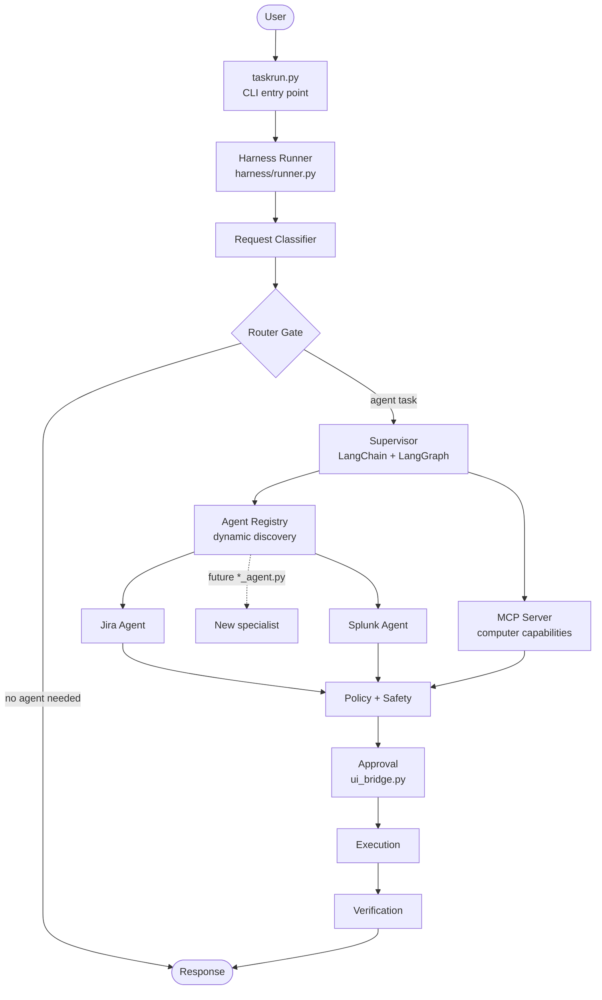
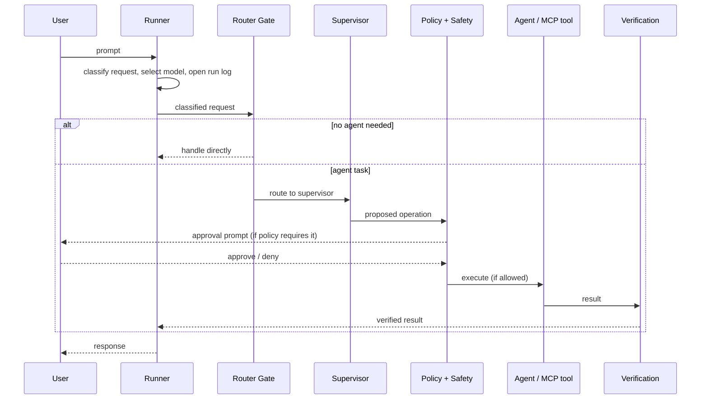

# JARVIS CLI

**A local-first agent harness for the terminal.** JARVIS classifies each request, routes it to the right specialist agent or computer tool, gates sensitive operations behind policy and approval, and verifies the result before responding, all from a single CLI. Every model runs locally, served through LM Studio and LiteLLM.


---

## Contents

- [Overview](#overview)
- [Key features](#key-features)
- [Architecture](#architecture)
- [Request lifecycle](#request-lifecycle)
- [Components](#components)
- [Model tiering](#model-tiering)
- [Specialist agents and the registry](#specialist-agents-and-the-registry)
- [MCP and computer operations](#mcp-and-computer-operations)
- [Safety, policy and approval](#safety-policy-and-approval)
- [Context, memory and observability](#context-memory-and-observability)
- [Routing experiments](#routing-experiments)
- [Project structure](#project-structure)
- [Getting started](#getting-started)
- [CLI commands](#cli-commands)
- [Extending JARVIS](#extending-jarvis)
- [Design decisions](#design-decisions)

---

## Overview

Most agent CLIs put everything in one place: prompt handling, service integrations, tool calls, and safety logic end up tangled in a single orchestration file. JARVIS is built around the opposite idea: **the CLI should not need to know how a task is performed.**

Each request moves through a fixed pipeline of narrow, independently replaceable stages:

```text
classify → route → supervise → select capability → policy/safety → approve → execute → verify → respond
```

The supervisor contains **no** Jira or Splunk code. Service-specific logic lives in the specialist agent that owns it, discovered at runtime through a registry. Computer-level tools live behind a separate MCP server with their own safety model. Adding a capability means adding a module, not editing the orchestrator.

## Key features

- **Request classification and router gate.** Not every prompt is an agent task. A gate in front of the supervisor keeps simple requests from paying the cost of a full agent run.
- **Supervisor built on LangChain and LangGraph.** Specialist agents are exposed to the supervisor as tools; LangGraph manages agent state and execution flow.
- **Dynamic agent discovery.** Drop a `*_agent.py` module into the project and `agent_registry.py` picks it up. No supervisor changes, no routing-table edits.
- **Tiered local models.** Large general and reasoning models (Gemma and Qwen variants served through LiteLLM) handle agent execution; a small Qwen model served by LM Studio handles routing, tool selection and safety classification. Nothing leaves the machine.
- **Model discovery from the CLI.** The `/models` command lists every registered model with its provider, description and capability tags.
- **Separate MCP server for computer operations.** Computer interaction has a different risk profile from calling a REST API, so it is isolated in `mcp_server.py`.
- **Policy, safety and approval pipeline.** A local model classifies the operation, policy decides whether it is allowed, requires approval or is rejected, and `ui_bridge.py` handles the approval prompt.
- **Post-execution verification.** Results are checked against the resulting state before being returned, rather than trusting the tool's own success message.
- **Context compaction.** Long sessions are kept within the model's window by summarizing older turns and retaining recent ones.
- **Per-run observability.** Every run gets an ID, timings, routing decisions, model selections and compaction events, all logged for after-the-fact inspection.
- **Runtime controls from the prompt.** Dry-run mode, a command queue, undo for reversible operations, background jobs, and scoped persistent memory, all driven by slash commands (see [CLI commands](#cli-commands)).

## Architecture



The main execution path starts in `taskrun.py` and enters the harness through `harness/runner.py`. The runner owns the **lifecycle** of a request (flow, context, routing, logging, model selection, error handling). It does not implement any agent's business logic.

## Request lifecycle



| Stage | Responsibility | Module |
|---|---|---|
| Entry | Parse CLI input, start a run | `taskrun.py` |
| Lifecycle | Context, model selection, logging, error handling | `harness/runner.py` |
| Classification | Decide what kind of request this is | `harness/request_classifier.py` |
| Gate | Decide whether the request needs an agent at all | `harness/router_gate.py` |
| Coordination | Choose and invoke specialist agents or MCP tools | `Supervisor.py` |
| Safety | Classify the operation, decide allow / approve / reject | `harness/safety.py`, `harness/policy.py` |
| Approval | Interactive confirmation | `harness/ui_bridge.py` |
| Verification | Check resulting state after execution | `harness/verification.py` |

## Components

| Component | What it does | Why it is separate |
|---|---|---|
| **Runner** | Owns the request lifecycle: run IDs, timing, routing decisions, compaction, error handling. | Orchestration concerns stay out of agent code. |
| **Request classifier** | Labels the incoming request before any agent is involved. | Cheap decision made once, up front. |
| **Router gate** | Sends agent-worthy requests to the supervisor and handles the rest directly. | Avoids a full agent loop for requests that do not need one. |
| **Supervisor** | Connects the language model to specialist agents and MCP tools through LangChain interfaces; LangGraph manages state and flow. | Pure coordination, with no service-specific code. |
| **Agent registry** | Discovers `*_agent.py` modules and exposes each specialist's metadata. | New agents plug in without touching the supervisor. |
| **Model registry / selector** | Holds model configuration and picks a model per task. | Changing a model never requires changing execution logic. |
| **MCP server** | Exposes computer-level capabilities as tools. | Different execution and safety model from REST-backed agents. |
| **Policy / safety / UI bridge** | Classify, decide, and ask for approval before sensitive operations. | Safety is a pipeline stage, not scattered `if` checks. |
| **Verification** | Confirms the outcome after execution. | Tool success messages are not treated as ground truth. |
| **Context / memory** | Tracks conversation state and compacts old history. | Keeps long sessions inside the model's context window. |
| **Logger** | Records run-level events. | Makes any execution inspectable after the fact. |
| **Queue / undo** | Request queueing and reversal where applicable. | Runtime conveniences isolated from core flow. |

## Model tiering

JARVIS does not treat every model call as the same kind of operation. All models run locally and come from two sources, and different parts of the system use different models.

**Model sources**

| Source | Used for |
|---|---|
| **LM Studio** (OpenAI-compatible API) | The small model used for routing, tool selection and safety classification |
| **LiteLLM** (local) | The larger general-purpose and reasoning models used for agent execution |

**Registered models**

| Model | Provider | Description | Capabilities |
|---|---|---|---|
| `qwen3-1.7b` | LM Studio | Lightweight model for routing, tool selection and safety classification | — |
| `gemma4-31b` | LiteLLM | Large general-purpose model | general, analysis, coding, tools |
| `gemma4-31b-thinking` | LiteLLM | Reasoning-focused Gemma model | reasoning, analysis, complex_tasks, coding |
| `qwen3-35b` | LiteLLM | Large Qwen general-purpose model | general, coding, tools, reasoning, analysis |
| `qwen3-35b-thinking` | LiteLLM | Reasoning-focused Qwen model | reasoning, complex_tasks, analysis, coding, tools |

The LiteLLM models are registered with a provider, a description and capability tags. The CLI lists them on demand:

```text
You > /models

══════════════════════════════════════════════════════════════════════════════
  AVAILABLE MODELS
──────────────────────────────────────────────────────────────────────────────
  gemma4-31b
      Provider: LiteLLM
      Large general-purpose model.
      Capabilities: general, analysis, coding, tools

  gemma4-31b-thinking
      Provider: LiteLLM
      Reasoning-focused Gemma model.
      Capabilities: reasoning, analysis, complex_tasks, coding

  qwen3-35b
      Provider: LiteLLM
      Large Qwen general-purpose model.
      Capabilities: general, coding, tools, reasoning, analysis

  qwen3-35b-thinking
      Provider: LiteLLM
      Reasoning-focused Qwen model.
      Capabilities: reasoning, complex_tasks, analysis, coding, tools
══════════════════════════════════════════════════════════════════════════════
```

Automatic model selection can be switched on or off at runtime with `/model_change on|off`, and `/model <name>` pins a specific model manually.

The reasoning behind this split: routing and safety checks run on **every** request, so they need to be fast and cheap, and a small model is enough for a narrow classification decision. The larger models are reserved for the work that needs them.

Model configuration is isolated from execution logic:

```text
harness/model_registry.py   # which models exist and how to reach them
harness/model_selector.py   # which model a given task should use
```

## Specialist agents and the registry

Specialists are discovered dynamically by `agent_registry.py`. Each one exposes:

| Field | Purpose |
|---|---|
| Name | Identifier the supervisor uses to reference the agent |
| Handled request types | What kind of requests this agent is for |
| System prompt | The agent's instructions |
| `get_agent()` | Factory returning the LangChain-compatible agent |

The supervisor wraps each registered specialist as a tool, so the model chooses between "Jira", "Splunk" or any future agent the same way it chooses any other tool.

**Currently included**

| Agent | Module | Capabilities |
|---|---|---|
| Jira | `jira_agent.py` | Talks to Jira via its REST API: retrieve issues, search with JQL |
| Splunk | `splunk_agent.py` | Read-oriented operations: run searches, retrieve index information |

Each agent owns its own service logic, which keeps credentials, API quirks and query handling out of the orchestration layer.

## MCP and computer operations

MCP is deliberately **not** part of the specialist-agent registry. It is implemented in `mcp_server.py` and handled separately because computer-level capabilities have a different execution and safety model from service-specific agents: an issue search is read-only and reversible, whereas a computer operation can change local state.

When a task requires computer interaction, the supervisor routes toward MCP tools, and the operation passes through the safety and approval pipeline before it runs.

## Safety, policy and approval

```text
Reasoning
   ↓
Tool selection
   ↓
Safety classification   (harness/safety.py, local model)
   ↓
Policy decision         (harness/policy.py)
   ↓
Approval                (harness/ui_bridge.py)
   ↓
Execution
   ↓
Verification            (harness/verification.py)
```

| Outcome | Behaviour |
|---|---|
| **Allowed** | Operation executes directly. |
| **Requires approval** | Execution is paused and the user is prompted through `ui_bridge.py`. |
| **Rejected** | Operation is blocked and not executed. |

Safety classification runs on a local model, so sensitive operations are assessed without leaving the machine. Policy is kept as its own module so that the rules for what is allowed can change without touching the classifier or the executor. After execution, `verification.py` checks the resulting state rather than trusting the tool's return value.

## Context, memory and observability

Sending the entire conversation to the model on every turn does not scale for a long-running CLI session, especially with local models and bounded context windows.

- **Compaction.** When context grows too large, `harness/runner.py` summarizes older messages and keeps recent ones verbatim.
- **Context and memory components** (`harness/context.py`, `harness/memory.py`) hold state across longer interactions.
- **Run tracking.** The runner records request/run IDs, timing, routing decisions, model selection, compaction events and execution results.
- **Logging.** `harness/logger.py` writes these events so a run can be reconstructed and debugged afterwards.

## Routing experiments

Routing quality determines both latency and correctness: a wrong gate decision either wastes an agent run or skips one that was needed. The repository includes experimental work comparing request-classification and routing approaches. These are kept **outside** the main execution path.

| File | Purpose |
|---|---|
| `benchmark_router.py` | Benchmark harness for comparing routing approaches |
| `test_aurelio_binary.py` | Binary routing experiment (Aurelio) |
| `test_aurelio_router.py` | Multi-route experiment (Aurelio) |
| `test_laya_conservative.py` | Conservative gating experiment (Laya) |
| `test_laya_gate.py` | Gate experiment (Laya) |

## Project structure

```text
.
├── taskrun.py                # CLI entry point
├── Supervisor.py             # Coordinates specialist agents and MCP tools
├── agent_registry.py         # Dynamic discovery of *_agent.py specialists
├── jira_agent.py             # Jira specialist (REST API, JQL search)
├── splunk_agent.py           # Splunk specialist (search, index info)
├── mcp_server.py             # MCP server for computer-level tools
├── requirements.txt          # Python dependencies
│
├── harness/
│   ├── runner.py             # Request lifecycle, compaction, run tracking
│   ├── context.py            # Execution context
│   ├── memory.py             # Conversation / session memory
│   ├── model_registry.py     # Model definitions and sources (LM Studio, LiteLLM)
│   ├── model_selector.py     # Per-task model selection
│   ├── request_classifier.py # Request classification
│   ├── router_gate.py        # Agent / no-agent gate
│   ├── policy.py             # Allow / approve / reject rules
│   ├── safety.py             # Local-model operation classification
│   ├── verification.py       # Post-execution checks
│   ├── ui_bridge.py          # Approval interaction
│   ├── logger.py             # Run-level event logging
│   ├── queue.py              # Request queueing
│   └── undo.py               # Undo support
│
├── tools/                    # Tool implementations
├── tests/                    # Test suite
│
├── benchmark_router.py       # Routing benchmark (experimental)
├── test_aurelio_binary.py    # Routing experiment
├── test_aurelio_router.py    # Routing experiment
├── test_laya_conservative.py # Routing experiment
└── test_laya_gate.py         # Routing experiment
```

## Getting started

### Prerequisites

- Python 3.10+
- [LM Studio](https://lmstudio.ai/) running locally with its OpenAI-compatible server enabled and `qwen3-1.7b` loaded
- [LiteLLM](https://docs.litellm.ai/) running locally and configured with the Gemma and Qwen models listed above
- Access to a Jira instance and a Splunk instance (for the respective agents)

### Install

```bash
git clone <repo-url>
cd <repo-name>
python -m venv .venv
source .venv/bin/activate
pip install -r requirements.txt
```

### Configure

Set the service endpoints and credentials through environment variables (or your `.env` file). The names below are examples; use the ones defined in your configuration.

```bash
# Local model server (LM Studio default)
LLM_BASE_URL=http://localhost:1234/v1

# LiteLLM (local)
LITELLM_BASE_URL=...
LITELLM_API_KEY=...

# Jira
JIRA_BASE_URL=https://your-domain.atlassian.net
JIRA_EMAIL=you@example.com
JIRA_API_TOKEN=...

# Splunk
SPLUNK_HOST=...
SPLUNK_TOKEN=...
```

External dependencies are intentionally kept outside the core orchestration logic, so the same harness works regardless of which services are configured.

### Run

```bash
python taskrun.py
```

### Test

```bash
pytest tests/
```

## CLI commands

The interactive shell exposes slash commands for controlling the harness at runtime. Type `/help` to list them.

**General**

| Command | Description |
|---|---|
| `/help` | Show all commands |
| `/status` | Show current TaskRun status |
| `/clear` | Clear the terminal screen |
| `/exit` | Exit TaskRun |

**Models**

| Command | Description |
|---|---|
| `/models` | List registered models with provider, description and capabilities |
| `/model` | Show model configuration |
| `/model <model>` | Manually select a model |
| `/model_change on` | Enable automatic model selection |
| `/model_change off` | Disable automatic model selection |

**Execution control**

| Command | Description |
|---|---|
| `/dryrun on` / `/dryrun off` | Enable or disable dry-run mode |
| `/queue on` / `/queue off` | Enable or disable command queue mode |
| `/queue` | Show queued commands |
| `/undo` | Undo the last reversible operation |

**Memory**

| Command | Description |
|---|---|
| `/memory` | Show stored memory |
| `/memory set <scope> <key> <value>` | Store a memory value |
| `/memory clear <scope> <key>` | Clear a memory value |

**Background jobs**

| Command | Description |
|---|---|
| `/bg <request>` | Run a request in the background |
| `/jobs` | List background jobs |
| `/job <id>` | Show background job details |
| `/cancel <id>` | Cancel a background job |

## Extending JARVIS

### Add a specialist agent

1. Create a new module named `<service>_agent.py` in the project root.
2. Expose the metadata the registry expects: name, handled request types, system prompt, and a `get_agent()` implementation.
3. Restart JARVIS. `agent_registry.py` discovers the module and the supervisor can route to it.

The supervisor, router gate and safety pipeline stay unchanged.

### Add a computer capability

Register the tool in `mcp_server.py`. It automatically falls under the safety, policy and approval pipeline, so define how `harness/policy.py` should treat it (allow, require approval, or reject).

### Swap or add a model

Edit `harness/model_registry.py` to register it and `harness/model_selector.py` to assign it to a task. No execution code changes.

## Design decisions

| Decision | Rationale |
|---|---|
| **Runner manages lifecycle, not logic** | Keeps orchestration, logging and error handling in one place and agent code focused on its own domain. |
| **Gate before the supervisor** | A full agent run is expensive; most requests that do not need one should never reach it. |
| **No service code in the supervisor** | Prevents the supervisor from becoming a pile of integrations; new services are new modules. |
| **Registry-based discovery** | Extending the system is additive: no routing tables to maintain. |
| **MCP separated from agents** | Computer operations carry different risk than REST calls, so they get their own execution and safety path. |
| **Small model for routing and safety** | These checks run on every request; a narrow decision does not need a large model. |
| **Policy separated from safety classification** | Classification (what is this operation?) and policy (what do we do about it?) change for different reasons. |
| **Verify after execution** | A tool reporting success is not the same as the system reaching the intended state. |
| **Model config separated from execution** | Models from either source (LM Studio, LiteLLM) can be swapped or added without touching the pipeline. |
| **Compaction instead of full history** | Bounds token usage and latency in long sessions on local models. |
| **Routing experiments outside the main path** | Lets routing approaches be benchmarked without destabilizing the runtime. |
